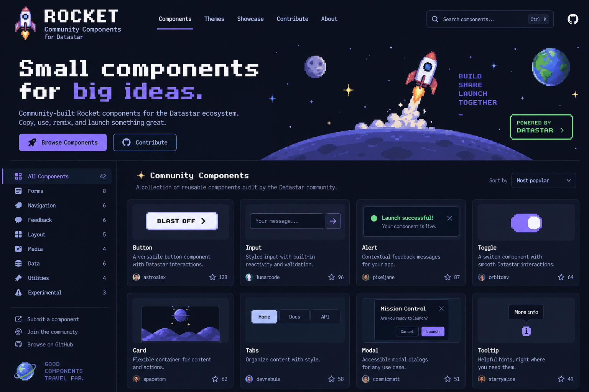

# Starbase

A community gallery of [Rocket](https://data-star.dev/reference/rocket) web components for [Datastar](https://data-star.dev), in the spirit of shoelace.style.

Go · templ · SQLite · Datastar + Rocket · CQRS · plain modern CSS. No Node, no bundler.



## Quick start

```sh
cp .env.example .env         # optional: add GitHub OAuth credentials
go tool task live            # dev server with live reload on http://localhost:7331
go tool task test            # vet + tests (including component validation)
go tool task build           # production binary in bin/starbase
```

Without GitHub credentials, dev builds sign you in as a fake user at `/auth/dev?login=you`.

## Adding a component

**No tools needed:** use the [submission form](/submit) (a GitHub issue form). Paste the code, or link the GitHub repo the component lives in, and a bot validates it, generates its manifest and opens a pull request. See `.github/workflows/component-from-issue.yml`.

### By hand

```sh
go tool task new -- my-widget --category forms --author your-handle
```

This creates `components/my-widget/README.md` (front matter + docs, where ```` ```html preview ```` blocks become live demos) and `my-widget.js` (the `rocket('sb-my-widget', …)` definition). Open `/components/my-widget` in the dev server. The page publishes Rocket's manifest and the server writes `manifest.json`, which drives the API tables. No Go changes are needed. See [/contribute](content/contribute.md) for the house rules.

Every component page also gets a **Playground**, generated from the manifest: number props become sliders, booleans toggles, `oneOf` selects and strings inputs. Each control is bound to a local signal that drives the live element through `data-attr`. Tune it in the README front matter:

```yaml
playground:
  props: { yaw: {min: -180, max: 180}, zoom: {min: 0.5, max: 3, step: 0.1} }
  values: { spin: 30 }        # initial values
  content: Blast off          # slotted content of the live element
  style: "inline-size: 18rem"
  attrs: { values: "[1,2,3]" } # static attributes, e.g. for props without a control
  exclude: [href]
```

## Architecture

CQRS in the style of [hyperlith](https://github.com/andersmurphy/hyperlith):

```
GET  /page           full server render (SEO), then data-init opens ↓
POST /page           the tab's render stream (SSE, Brotli): render → wait for hub → render …
POST /cmd/...        commands: validate → enqueue → 204. Never HTML.
                     single writer: drain queue → one transaction (savepoint per command)
                     → commit → wake affected streams (per session, or all)
```

- **Write side:** `internal/cqrs` (Bus and Hub) and `internal/commands` (one struct per state change).
- **Read side:** `internal/queries` runs every render inside one read transaction.
- **Views:** `internal/ui` holds templ components, pure functions of the read model. The same function serves the GET and every stream frame. Datastar morphs `#app`.
- **Per-tab UI state** (filters, sort, preview theme) is stored in SQLite, in `tab_state`. The stream keeps the URL in sync.
- **Catalog:** `components/` is embedded. At startup `SyncCatalog` mirrors it into SQLite (FTS5 for search).
- **Design system:** `static/css`. Primitive `--sb-*` tokens feed semantic tokens, which feed components. Layers, container queries, nesting and OKLCH. Themes remap the semantic tokens only.
- **Pixel art** is generated in Go (`internal/pixelart`) and served as cached SVG.
- **Code playground:** `/playground` (and "Open in playground" on every component) edits a component's JS and HTML with `sb-code-editor` and `sb-code-playground`. Previews run in a `sandbox="allow-scripts"` iframe served by `/playground/run`, with its own CSP and an opaque origin. "Save & share" is the `SaveSnippet` command (immutable `/playground?s=<id>` links). "Submit as component" prefills the issue form with that link, and the bot imports it (set the repository variable `STARBASE_URL`).
- **Live demo data:** `GET /demo/telemetry` streams a simulated mission as signal patches (`$_tm`). It is a pure function of time, with no state. The Showcase page's Mission Control and the gauge, sparkline and meter docs use it.

## Deployment note: serve over HTTP/2

Every open tab keeps one long-lived SSE connection (its render stream). Over HTTP/1.1, browsers allow only 6 connections per host *across all tabs*, so a few open tabs can starve new requests. They sit "Stalled" in DevTools. Put the server behind a TLS proxy that speaks HTTP/2 (Caddy, nginx, a CDN), where all streams share one multiplexed connection. Browsers only use HTTP/2 over TLS, so this matters most in production, and when testing with many tabs.

## Configuration

| Variable | Default | |
|---|---|---|
| `ADDR` | `:7331` | listen address |
| `BASE_URL` | `http://localhost:7331` | public origin (OAuth callback, CSRF origin, `__Host-` cookies on https) |
| `DB_PATH` | `data/starbase.db` | SQLite file |
| `REPO_URL` | `https://github.com/zweiundeins/starbase` | "Edit on GitHub" links |
| `GITHUB_CLIENT_ID` / `GITHUB_CLIENT_SECRET` | | GitHub OAuth app; callback `$BASE_URL/auth/github/callback` |

## Licences

Code MIT. Fonts: Pixelify Sans and JetBrains Mono (SIL OFL, see `static/fonts`). Icons: Lucide (ISC), GitHub mark (MIT, Octicons). Datastar + Rocket bundle: MIT, vendored in `static/vendor`.
